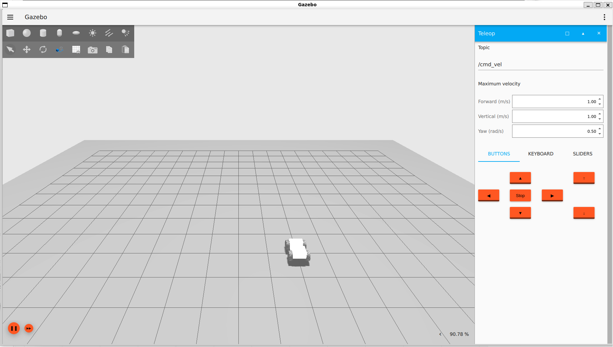

# rover_gazebo

The package contains a launch file and source files used to run the robot simulation in Gazebo.

## Config Files

- `gz_bridge.yaml` - Gazebo bridge configuration.

## Launch Files

- `simulation.launch.py` - Launch simulation.

## Running

```bash
ros2 launch rover_gazebo simulation.launch.py
```

## Gazebo:

